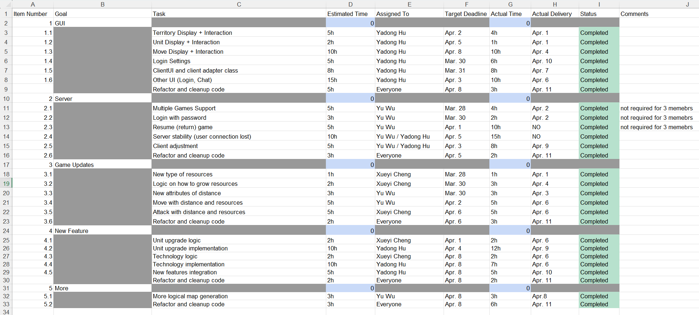
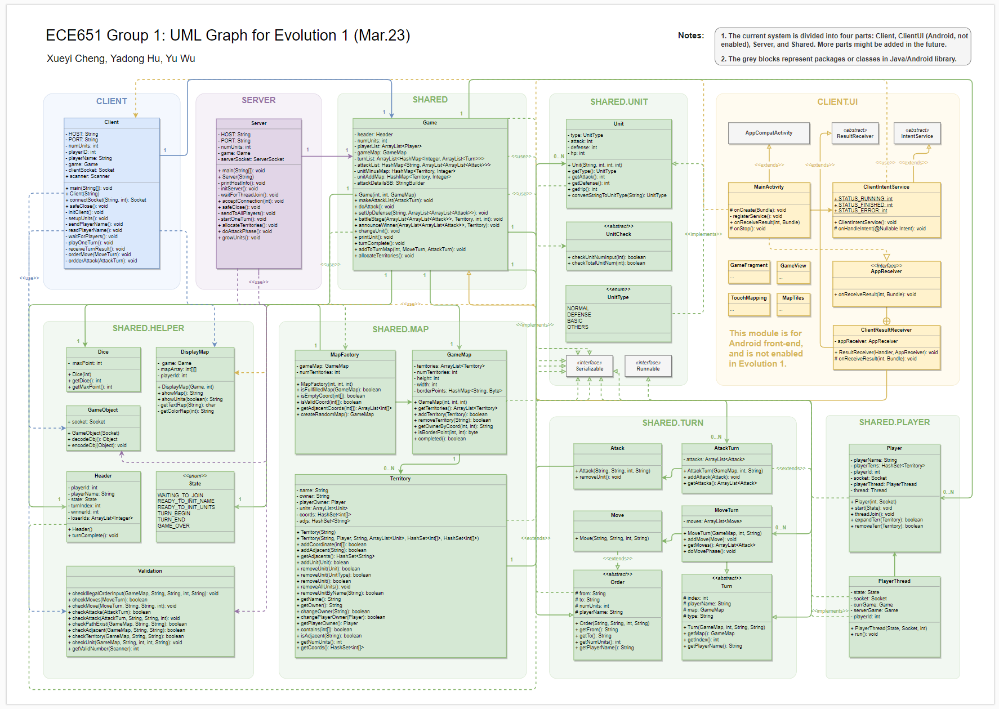
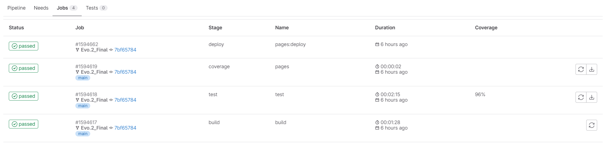
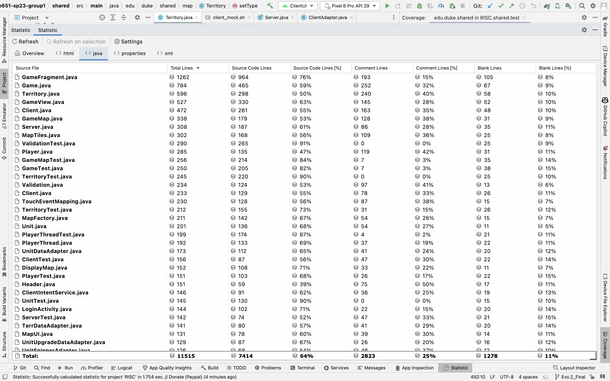
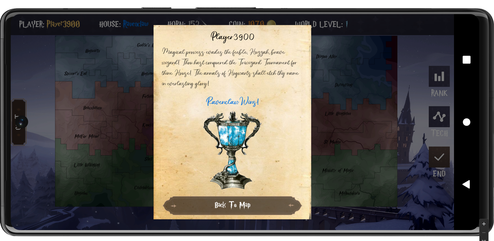

# ECE 651 RISC Project Group 1 


## 0. Group Members
- 👧 **Xueyi Cheng** (xc187)
- 👦 **Yadong Hu** (yh342)
- 👦 **Yu Wu** (yw541)


## 1. Project Task List

**Evo.1: Click [here](https://prodduke-my.sharepoint.com/:x:/r/personal/yh342_duke_edu/Documents/ECE%20651%20Group%201%20Project%20Task%20List.xlsx?d=w18e83f614ba7499d93c805d3011429e5&csf=1&web=1&e=59rJHC) to visit Excel document.**

📜 **Evo.2: Click [here](https://prodduke-my.sharepoint.com/:x:/r/personal/yh342_duke_edu/Documents/ECE%20651%20Group%201%20Project%20Task%20List%202.xlsx?d=w32f7a3e5ffe141df89e353e57f693456&csf=1&web=1&e=teC1Hw) to visit Excel document.**




## 2. UML Graph

🔎 **Click [here](https://drive.google.com/file/d/1a_QFIG-tIONUMT96SDqLrqM56fD0q7UY/view?usp=sharing) to see the full picture.**




## 3. Coverage Report & Statics

📃 **Click [here](https://hugo.pages.oit.duke.edu/ece651-sp23-group1) for three submodules coverage reports.**






## 4. Tutorials

💡 For this evolution 2, you need to run **1 server** and **4 clients** (this is a fixed number at present). Each client will be assigned to one house according to the Harry Potter world setting: Gryffindor, Hufflepuff, Ravenclaw or Slytherin.

### 4.1. Start the Server

✅ Run the server by command:
```bash
./gradlew :server:run
```
Wait for players to connect to the server. 

### 4.2. Start the Clients

✅ To see the clientUI interface, run the clientUI configuration by clicking the triangle button.


If you want to change the virtual machine address, go to ClientAdapter.java and change the Host field.

✅ If it runs smoothly, you will see one of the waiting page here:


✅ Next, you can choose to play with your three other friends(let them run the clientUI as well), or play with the mock client
by running the command: 
```bash
./client_mock.sh
# Notice: In the file client_mock.sh, change "vcm-xxxxx.vm.duke.edu" to your own virtual machine name.
```

### 4.3. Player login

🔱 4.3.1. When all **4 players** have joined the game, the game will switch to the login page, which is one of the follows:

🔷 Note: We didn't actually implement the functions of login pages, so users can input whatever they want in it.


🔱 4.3.2.  After all others have login, you will then automatically be assigned your house. Each player could be
randomly assigned to one of the four harry potter houses: Gryffindor, Hufflepuff, Ravenclaw or Slytheri, whose color is aligned with the territory color. After clicking the "I'm pleased to accept my offer", user will go into next stage.


### 4.4. Players' Unit Allocations

🔱 4.4.1. After accepted the offer, you can allocate units according to your requirements. Use the sliding bar and place all 24 units, then click End button in the page.


### 4.5. Game Stage

🔱 4.5.1. The server sends maps to all the players and the game begins! All players can see the current turn number, and after the first turn, they can see each player's unit allocation in this turn. 

🔱 4.5.2. The user can click one territory, and there'll be three choices: Units,Order and Property. Units allows user to upgrade unist, Order allows user to make a Move/Attack order, and Property allows user to check this territory's type and descriptions.


Each player can choose to attack or move or upgrade, and they can do as many orders as they want in one turn as long as they have enough units. After all is done, click the "End" button on the right.

🔱 4.5.3. The following screen shots are for Unit upgrade and Move:


🔱 4.5.4. The following screen shots are for territory type descriptions:


🔱 4.5.5. By clicking the "Tech" button on the right, the user can also upgrade the world tech level using horns, as the following screen shots shown:


🔱 4.5.6. After all players have finished placing order, this turn will end, and in the next turn all battles results will shown on the map, and the corresponding resources will be added to users based on the territories they have.

### 4.6. Game Over

🔰 4.6.1. If one player has lost all his/her territories, then he/she lost. If he/she hasn't lost, they can also click the "player" on the upper left and chose to surrender.

🔰 4.6.2. If then, there is only one player left, he/she is the winner, and the following pis will be shown:




## 5. Moreover

🦋 This game is still being developed. We will keep updating the game and add more features in the future. If you have any suggestions, please feel free to contact us. Thank you for your time and enjoy the game!

