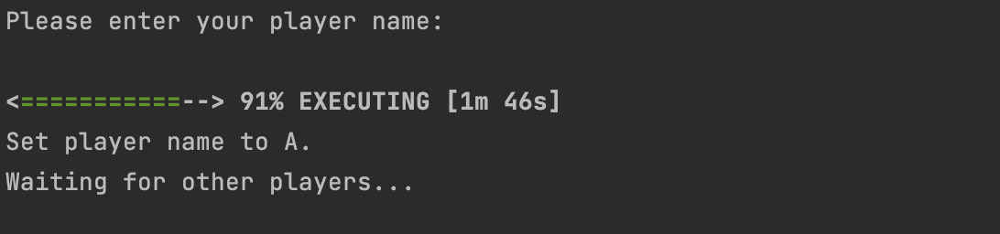
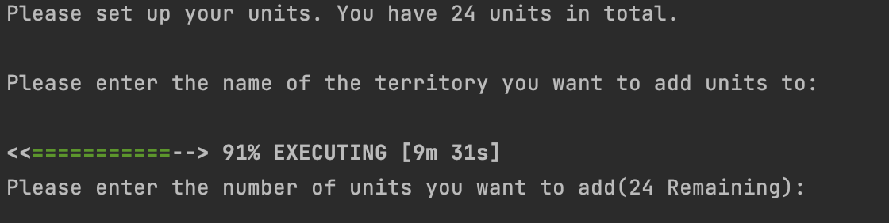
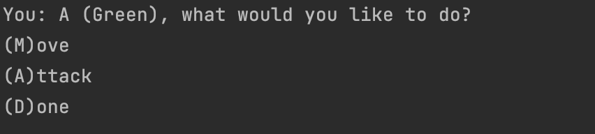

# ece651-risc-group1

- Xueyi Cheng
- Yadong Hu
- Yu Wu

## Project Task Lisk

**Click [here](https://prodduke-my.sharepoint.com/:x:/r/personal/yh342_duke_edu/Documents/ECE%20651%20Group%201%20Project%20Task%20List.xlsx?d=w18e83f614ba7499d93c805d3011429e5&csf=1&web=1&e=59rJHC) to see our task list Excel.**

## UML Graph

**Click [here](https://drive.google.com/file/d/13v6J-FuXI0Vu6otDA5NVHJfm0nQvAoAf/view?usp=sharing) to see our UML Graph.**

## Coverage Report

**Click [here](https://hugo.pages.oit.duke.edu/ece651-sp23-group1) for three submodules coverage reports.**

# Play The Game

### 1. Start the Server

1.1. Run the server by command **./gradlew :server:run**

1.2  Wait for players to connect the srever

### 2. Players Input Names

2.1  Run the client by command line. You need to input your HOST NAME as an argument in the command. For example, if your  host name is "0.0.0.0", you should ues this command: **./gradlew :client:run --args="0.0.0.0"**

2.2  There should be prompt "Please enter your player name:". Type in your user name (Note: each player should have thier unique name)

2.3  Wait for other clients to finish inputing their names. You will then automatically assigned your game ID.

### 3. Players Input Unit Allocations

3.1  After all players input their names, there will be a display of gamemap as well as the text descriptions. There will be a prompt of "Please enter the name of the territory you want to add units to:", and you should enter the alphabet representing the land you want to add units to; After that, there be a prompt of "Please enter the number of units you want to add(24 Remaining):", and you should just input a number for it. If you don't use up all 24 units, this prompt loop will keep going on until you do.

3.2  After you finish unit allocation, you will see the prompt"Total units placed: 24. You have placed exactly 24 units." You should just wait for other clients to finish inputing their units allocations.

### 4. Game Stage

4.1  The server sends maps to all the players and the game begins! All players can see the current turn number, as well as each player's unit allocation in this turn. 

4.2  There will be prompt "You: X(your use name), what would you like to do? (M)ove (A)ttack (D)one“
Each player can choose to Attack or Move or Finish Order, and they can do as many orders as they want in one turn as long as they have enough units. 

4.3  If the player choose Move, then he/she should type in "M"; then the player should enter the name of territory he/she wants to move from, the name of territory he/she wants to move to, and the number of units he/she wants to move. After all the inputs and press Enter Key, the move order will be executed automatically and the user can see the unit change.

4.4  If the player choose Attack, then he/she should type in "A"; then the player should nter the name of territory he/she wants to attack from, the name of territory he/she wants to attack to, and the number of units he/she wants to use in attack. After all the inputs and press Enter Key, the attack order is then placed, but none of the attack will be executed until all players have finished placing their orders.

4.5  If the player thinks he/she can finish placs orders in this turn, then he/she should type "D".  There be a prompt "Waiting for other players..." indicating the player is in the waiting stage.

4.6  After all players have finished ordering, the server will show "Received all action lists.", and start the battling stage. It will print each battle info, demonstrating who is the winner of this battle. Then, a new turn begins.

4.7   If one player has lost all his/her territories, then he/she lost. There will be prompt "Player X has lost the game. Game continues." If there is only one player left, then he/she is the winner, showing " Game Over. Player X wins!"

