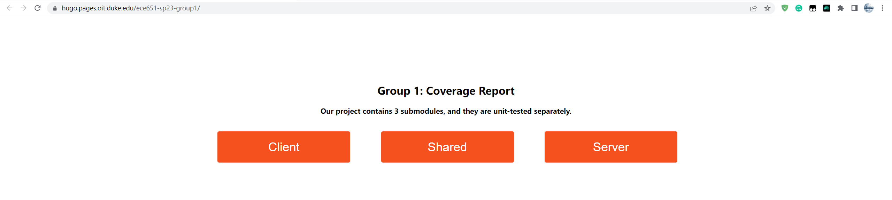
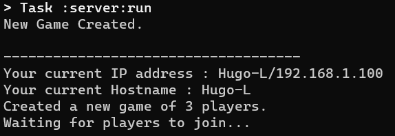
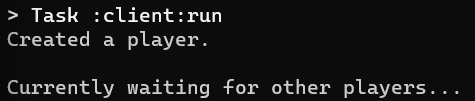
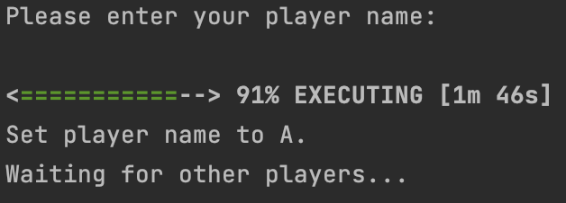
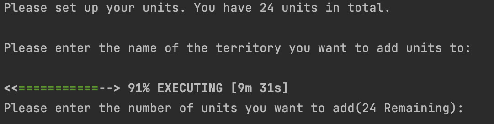
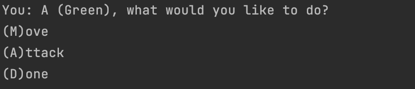
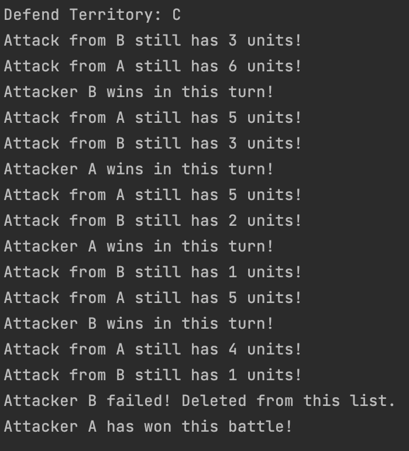

# ECE 651 RISC Project Group 1 


## 0. Group Members
- 👧 **Xueyi Cheng** (xc187)
- 👦 **Yadong Hu** (yh342)
- 👦 **Yu Wu** (yw541)


## 1. Project Task List

**Evo.1: Click [here](https://prodduke-my.sharepoint.com/:x:/r/personal/yh342_duke_edu/Documents/ECE%20651%20Group%201%20Project%20Task%20List.xlsx?d=w18e83f614ba7499d93c805d3011429e5&csf=1&web=1&e=59rJHC) to visit Excel document.**

📜 **Evo.2: Click [here](https://prodduke-my.sharepoint.com/:x:/r/personal/yh342_duke_edu/Documents/ECE%20651%20Group%201%20Project%20Task%20List%202.xlsx?d=w32f7a3e5ffe141df89e353e57f693456&csf=1&web=1&e=teC1Hw) to visit Excel document.**


## 2. UML Graph

🔎 **Click [here](https://drive.google.com/file/d/1a_QFIG-tIONUMT96SDqLrqM56fD0q7UY/view?usp=sharing) to see the full picture.**


## 3. Coverage Report

📃 **Click [here](https://hugo.pages.oit.duke.edu/ece651-sp23-group1) for three submodules coverage reports.**




## 4. Tutorials

💡 For this evolution 1, you need to run **1 server** and **3 clients** (this is a fixed number at present). The order to run the server and clients does not matter.

### 4.1. Start the Server

✅ Run the server by command:
```bash
./gradlew :server:run
```

Wait for players to connect to the server. You will see the prompt: **"Waiting for players to join..."**.



### 4.2. Start the Clients

✅ Run the client by command line. You need to input your **"HOST NAME"** as an argument in the command. For example, if your host name is "0.0.0.0" (such as you are running the server on your local machine), you should ues this command: 
```bash
./gradlew :client:run --args="0.0.0.0"
# Change "0.0.0.0" to "vcm-xxxxx.vm.duke.edu" if you are running the server on the VM.
```

You then should see the prompt: **"Currently waiting for other players..."**.



### 4.3. Players' Input Names

🔱 4.3.1. When all **3 players** have joined the game, there should be a prompt: **"Please enter your player name:"** on the client side. Type in your user's name 

🔷 Note: we suggest each player has a unique name, but it is not required.




🔱 4.3.2.  Wait for other clients to finish input their names. You will then automatically be assigned your game ID.

### 4.4. Players' Unit Allocations

🔱 4.4.1. After all players input their names, there will be a display of game map as well as the text descriptions. There will be a prompt: **"Please enter the name of the territory you want to add units to:"**, and you should enter the alphabet representing the land you want to add units to; 

🔱 4.4.2. After that, there be a prompt of: **"Please enter the number of units you want to add(24 Remaining):"**, and you should just input a number for it. If you don't use up all 24 units, this prompt loop will keep going until you enter correctly.



🔱 4.4.3. After you finish all your territories' unit allocation, you will see the prompt: **"Total units placed: 24. You have placed exactly 24 units."** You should just wait for other clients to finish inputing their units.

### 4.5. Game Stage

🔱 4.5.1. The server sends maps to all the players and the game begins! All players can see the current turn number, as well as each player's unit allocation in this turn. 

🔱 4.5.2. There will be prompt: **"You: X(Your User Name), what would you like to do? (M)ove (A)ttack (D)one“**.



Each player can choose to attack or move or commit orders, and they can do as many orders as they want in one turn as long as they have enough units.

🔴 **Note: After each order is placed, the map will be updated automatically. But this doesn't mean you have successfully executes this order. All orders are finalized on the server side.**

🔱 4.5.3. If the player choose to **Move**, then he/she should type in **"M"**; then the player should enter the name of territory he/she wants to move from, the name of territory he/she wants to move to, and the number of units he/she wants to move. 

🔱 4.5.4. If the player choose to **Attack**, then he/she should type in **"A"**; then the player should enter the name of territory he/she wants to attack from, the name of territory he/she wants to attack to, and the number of units he/she wants to use in attack. 

🔱 4.5.5. If the player thinks he/she can **Place Orders** in this turn, then he/she should type **"D"**. There be a prompt: **"Waiting for other players..."** indicating the player is in the waiting stage.

🔱 4.5.6. After all players have finished, the server will show: **"Received all action lists."**, and start the battling stage. It will print each battle info, demonstrating who is the winner of this battle. Then, a new turn begins.



### 4.6. Game Over

🔰 4.6.1. If one player has lost all his/her territories, then he/she lost. There will be prompt: **"Player X has lost the game. Game continues."** on the server side.

🔰 4.6.2. If then, there is only one player left, he/she is the winner, both server side and client side show: **"Game Over. Player X wins!"**.


## 5. Moreover

🦋 This game is still being developed. We will keep updating the game and add more features in the future. If you have any suggestions, please feel free to contact us. Thank you for your time and enjoy the game!

