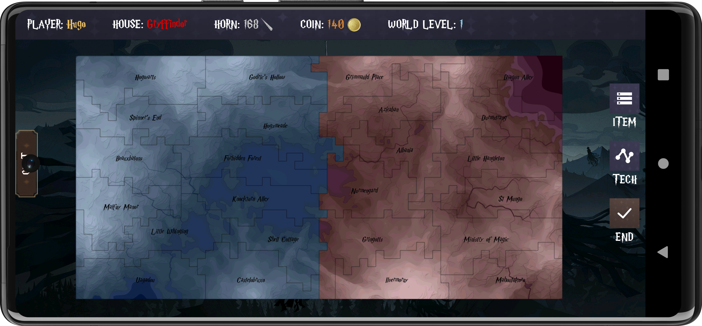

# Duke ECE 651 RISC Project [Group 1]


# Table of Contents
0. [Group Members](#0-group-members)
1. [Project Task List](#1-project-task-list)
2. [UML Graph](#2-uml-graph)
3. [Coverage Report & Statistics](#3-coverage-report--statistics)
4. [Demo](#4-demo)
5. [Tutorials](#5-tutorials)
    1. [Start the Server](#51-start-the-server)
    2. [Start the Clients](#52-start-the-clients)
    3. [Player login](#53-player-login)
    4. [Unit Allocations](#54-unit-allocations)
    5. [Game Stage](#55-game-stage)
    6. [New features](#56-new-features)
6. [Moreover](#6-moreover)
7. [CopyRight](#7-copyright)
8. [License](#8-license)


## 0. Group Members

- 👧 **Xueyi Cheng** (xc187)
- 👦 **Yadong Hu** (yh342)
- 👦 **Yu Wu** (yw541)


## 1. Project Task List

- **Evo.1:
Click [here](https://prodduke-my.sharepoint.com/:x:/r/personal/yh342_duke_edu/Documents/ECE%20651%20Group%201%20Project%20Task%20List.xlsx?d=w18e83f614ba7499d93c805d3011429e5&csf=1&web=1&e=59rJHC)
to visit Excel document.**

- **Evo.2:
Click [here](https://prodduke-my.sharepoint.com/:x:/r/personal/yh342_duke_edu/Documents/ECE%20651%20Group%201%20Project%20Task%20List%202.xlsx?d=w32f7a3e5ffe141df89e353e57f693456&csf=1&web=1&e=teC1Hw)
to visit Excel document.**

- 📜 **Evo.3:
Document not required!**


## 2. UML Graph

- **Evo.1:
Click [here](https://drive.google.com/file/d/1a_QFIG-tIONUMT96SDqLrqM56fD0q7UY/view?usp=sharing)
to view the full picture.**

- **Evo.2: Not required!**

- 🔎 **Evo.3: Not required!**


## 3. Coverage Report & Statistics

- 📃 **Evo.3: Click [here](assets/Images/cicd.png) for the CI/CD coverage reports.**

- 📊 **Evo.3: Click ([Project](assets/Images/statistics_whole.png), [Java1](assets/Images/statistics_java1.png), [Java2](assets/Images/statistics_java2.png), [Java3](assets/Images/statistics_java3.png), [Xml](assets/Images/statistics_xml.png)) for the project code statistics.**


## 4. Demo

| Login Page | |
| :---: | :---: |
| ||
|  | |

<i>For more login pages, please refer to [here](assets/Evo3/login_more.PNG). </i>


| House Page | |
| :---: | :---: |
| ||
|  | |

| Buff & Skill & Horcrux Page | |
| :---: | :---: |
| ||
|  | |

| World Technology Page | |
| :---: | :---: |
| ||
| ||

<i>For more world technology pages, please refer to [here](assets/Evo3/wand_more.PNG). </i>


| Unit & Move & Attack Page | |
| :---: | :---: |
| ||
| ||

<i>For more unit upgrade pages, please refer to [here](assets/Evo3/unit_upgrade_more.PNG). </i>


| Action Page | |
| :---: | :---: |
| ||

<i>For more territory property pages, please refer to [here](assets/Evo3/terr_property_more.PNG). </i>


| Game Over Page | |
| :---: | :---: |
| ||
|  | |

| Other Page | |
| :---: | :---: |
| ||
|  | |

<i>For more waiting pages, please refer to [here](assets/Evo3/waiting_more.PNG). </i>


| Game Supports 2~4 Players | |
| :---: | :---: |
| ||
|  | |


## 5. Tutorials

💡 For this Evolution 3 (final version), you need to run **1 server** and **2~4 clients**. Each client will be assigned to one house according to the Harry Potter world setting:
Gryffindor, Hufflepuff, Ravenclaw or Slytherin.

### 5.1. Start the Server

✅ Run the server by command:

```bash
./gradlew :server:run
```

Wait for players to connect to the server.


### 5.2. Start the Clients

✅ Start the Andoird application by running the ```ClientUI``` Configuration:


If you want to change the virtual machine address, go to ```ClientAdapter.java``` and change the ```Host``` field:

```java
// Change this IP address to your own virtual machine address
private static final String HOST = "114.514.0.0";
```

✅ If it runs smoothly, you will see one of the waiting page like this:


✅ Next, you can choose to play with your other friends (let them run the Android application as well), or play with ```AI``` by running the command:

```bash
# Change "vcm-xxxxx.vm.duke.edu" in "client_mock.sh" 
# to your own virtual machine host name, and add or 
# delete some clients if you need.
./client_mock.sh
```


### 5.3. Player login

🔱 5.3.1. When all **2~4 players** have joined the game, it switches to the login page.

🔷 Note: We didn't actually implement the functions of login pages, so users can input whatever they want in it. But the ```Username``` you entered should be unique, and it will be your player name during the game.


🔱 5.3.2. After all others have logged in, you will then automatically be assigned with your **house**, and whose color is aligned with the territory color. After clicking the "I'm pleased to accept my offer", user goes into next stage.


### 5.4. Unit Allocations

🔱 5.4.1. After accepted the offer, you can allocate units according to your requirements. Use the sliding bar and place **exactly 24 units**, then back to the map, and click ```End``` button on the right side.


### 5.5. Game Stage

🔱 5.5.1. The server sends maps to all the players and the game begins! 

All players can see the current turn number, and after the first turn, they can see each player's unit in their territories.

🔱 5.5.2. The user can click one territory, and there are three choices: ```Units```, ```Order``` and ```Property```.

- ```Units``` allows user to upgrade units.

- ```Order``` allows user to make a **Move/Attack** actions.

- ```Property``` allows user to check this territory's type and descriptions.


Each player can choose to attack or move or upgrade, and they can do as many orders as they want in one turn as long as they have enough **units** or **resources**. After all are done, click the ```End``` button on the right to commit this turn.

🔱 5.5.3. The following screenshots are for ```Unit``` upgrades. The **green** or **red** numbers appending at the end indicate the change of that creature in this turn. 


If you successfully upgrade units, you will see the following prompt:


🔱 5.5.4. The following screenshots are for ```Territory``` Type descriptions:


🔱 5.5.5. The ```Order``` action is complicated. It shows you every territory that you may want to move or attack. If you click any **your own territory**, you then go to the ```Move``` page; and if you click any **adjacent enemy's territory**, then you go to the ```Attack``` page.


🔱 5.5.6. By clicking the ```Tech``` button on the right, the user can also upgrade the world technology level using **unicron horns**, as the following screenshots shown:


🔱 5.5.7. Players can also use ```Horcrux``` as of Evolution 3. This will be covered in the following sections.

After all players have finished commiting orders, this turn ends, and in the next turn all battles results will shown on the map, and the corresponding resources will be added to users based on the territories they have.


### 5.6. New features

🔱 5.6.1. ```Horcrux```: Every two turns, a ```Horcrux``` will be randomly assigned to one of the players. The Horcrux is obtained at the beginning of the turn, and can be utilized in this current turn or furture turns. 

There are six types of Horcuxes: 

- 🌟 **Riddle's Diary**: Randomly disable one opponent's actions for his/her next turn.

- 🌟 **Gaunt's Ring**: Instantly revive the 10 Gnome units.

- 🌟 **Slytherin's Locket**: Destroy all the Dwarf troops for a random opponent in their next turn.

- 🌟 **Hufflepuff's Cup**: Instantly increase the number of gold coins by 300.

- 🌟 **Ravenclaw's Diadem**: Immediately increase the number of unicorn horns by 150.

- 🌟 **Nagini**: Immediately randomly capture an adjacent enemy territory (troops on the territory become yours).


🔱 5.6.2. ```Buff```: At the beginning of this game, each player is assigned one ```Buff``` according to their House. The Buff will automatically take effect through the whole game process. 

- 💫 **Heart of a Warrior (Gryffindor)**: 50% chance of 1 bonus of creature counting as 1.5 bonus (rounded down) during an attack.

- 💫 **Crown of Wisdom (Ravenclaw)**: An additional 15 of unicorn horns each turn.

- 💫 **Shield of Loyalty (Hufflepuff)**: 20% chance of turning a failed defense into a success, and eliminating all attacking forces.

- 💫 **Cunning Claw (Slytherin)**: Resource consumption (move and attack) reduced by 20%.


🔱 5.6.3. ```Skill```: At the beginning of the game, each player will also be assigned one special ```Skill``` according to their House. The special Skill can only be used once.

- 🔮 **Lion's Courage (Gryffindor)**: In the next turn, 30 units of Gnome soldiers will be granted to thee in a random territory.

- 🔮 **Wings of Wisdom (Ravenclaw)**: In the next turn, the unicorn horns required for upgrading all units will be halved.

- 🔮 **Steadfast Roots (Hufflepuff)**: In the next turn, thou shalt be immune to attacks (attacking forces will be repelled).

- 🔮 **Serpent's Strategy (Slytherin)**: In the next turn, all the werewolf creatures of all enemies will be destroyed.


### 5.7. Game Over

🔰 4.7.1. If one player has lost all her territories, then she lost. If she hasn't lost, they can also click the "player" on the upper left and chose to surrender.

🔰 4.7.2. If then, there is only one player left, she is the **Winner**, and the following picture (according to her ```House```) will be shown to give her the ```Triwizard Cup```!


## 6. Moreover

🦋 This game has launched its final version. 

If you have any suggestions, please feel free to contact us. 

This project is open sourced on GitHub to help later Duke students better learn the course.


## 7. CopyRight

© Most of the assets used in this project came from the official **Harry Potter: The Wizarding Awakening** website and mobile games. This project is for personal study only, please do not use the materials for commercial purposes.


## 8. License

⚖️ This project is under the Apache License 2.0.
